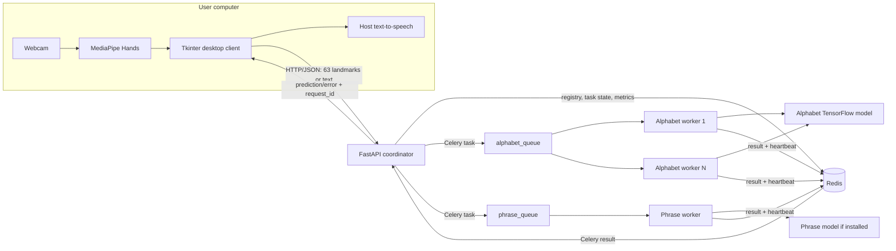
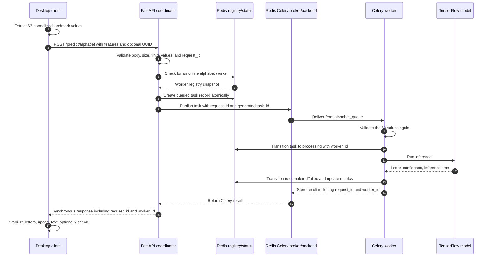

# Distributed ASL-to-Speech Translation System

University project for a **Distributed Programming** subject.

## 1. Problem statement

People who communicate using American Sign Language (ASL) may need a fast way to turn hand signs into readable text and spoken audio. Running camera capture, landmark extraction, API coordination, model inference, service discovery, task tracking, and speech generation in one process makes the system difficult to scale, observe, and recover when a component fails.

This project separates those responsibilities into a host desktop client, a FastAPI coordinator, Redis, and specialized Celery workers. The current bundled alphabet model classifies a single normalized MediaPipe hand-landmark vector containing 63 finite values (21 landmarks × x/y/z). The desktop client builds recognized letters into text and uses host text-to-speech. Phrase text normalization is implemented; dynamic 30-frame phrase inference has an API and worker path, but its trained model is not included in the repository.

## 2. Objectives

- Capture webcam input locally and extract MediaPipe landmarks without sending camera images to the server.
- Distribute alphabet inference and phrase work through dedicated Celery queues.
- Allow multiple workers to compete for tasks and scale horizontally.
- Track requests with UUID request IDs and Celery task IDs.
- Register workers, refresh heartbeats, and detect unavailable workers.
- Apply finite timeouts, bounded retries, and late acknowledgement for recoverable failures.
- Expose task status, worker status, health, and lightweight metrics through HTTP APIs.
- Provide repeatable tests, scalability benchmarks, and failure-recovery demonstrations.
- Preserve a usable Tkinter interface with text buffering and host text-to-speech.

## 3. Distributed architecture



Redis has several logical roles in this diagram but is one Redis instance in the supplied configuration: Celery broker, Celery result backend, worker registry, task-status store, and metrics store.

## 4. Component responsibilities

| Component | Responsibility |
|---|---|
| `client/app.py` | Tkinter UI, text buffer, service-status display, request submission, and UI-thread-safe result handling |
| `client/camera.py` | Webcam capture, MediaPipe hand detection, wrist-relative/scale-normalized 63-feature extraction; images remain on the host |
| `client/voice_service.py` | Host text-to-speech using `pyttsx3` |
| `client/service_status.py` | Background polling of health, workers, metrics, and the most recent task without blocking Tkinter |
| `coordinator/main.py` | FastAPI validation, request-ID handling, worker availability check, task publication, synchronous result wait, errors, and status endpoints |
| `coordinator/worker_registry.py` | Redis-backed registration, heartbeat refresh, privacy-safe public worker records, and offline detection |
| `coordinator/result_store.py` | Atomic Redis task-state transitions and expiring task metadata |
| `coordinator/metrics_store.py` | Fixed counters and expiring per-minute throughput counters |
| `workers/celery_app.py` | Celery broker/backend configuration, routes, acknowledgements, prefetch, and time limits |
| `workers/alphabet_tasks.py` | Worker-boundary validation and alphabet inference task |
| `workers/phrase_tasks.py` | Dynamic phrase task and implemented dictionary-based phrase normalization task |
| `workers/worker_lifecycle.py` | Celery-ready registration, one heartbeat thread per worker, and clean offline marking |
| `models/alphabet_landmarks.keras` | Bundled 63-input, 26-output alphabet model |

## 5. Complete prediction request lifecycle



The coordinator accepts a valid client UUID or generates a UUID when one is omitted. It separately generates a Celery `task_id`. Redis records move through:

```text
queued → processing → completed
                  └→ failed
queued/processing → timed_out
```

Terminal state changes are atomic Redis Lua operations. A late result cannot replace a recorded timeout. Task records expire after `TASK_STATUS_EXPIRATION_SECONDS`.

## 6. Why FastAPI, Redis, and Celery

### FastAPI

FastAPI provides typed request validation, clear HTTP errors, synchronous endpoints for the existing desktop client, automatic OpenAPI documentation at `/docs`, and lightweight health/status APIs. The coordinator is kept separate from camera and model code so clients and workers can run on different machines.

### Redis

Redis provides the low-latency shared state needed by independent processes. It is used as the Celery broker and result backend and also stores expiring worker records, request/task metadata, task counters, and bounded per-minute throughput records. This is suitable for a classroom deployment, although a production system would normally separate or secure these responsibilities more carefully.

### Celery

Celery supplies named queues, competing consumers, result retrieval, retry policies, acknowledgements, and worker lifecycle signals. Workers can be added without changing the desktop client or coordinator API.

## 7. Queue design

| Queue | Celery tasks | Worker type |
|---|---|---|
| `alphabet_queue` | `workers.alphabet_tasks.predict_alphabet` | Alphabet worker |
| `phrase_queue` | `workers.phrase_tasks.predict_phrase`, `workers.phrase_tasks.normalize_phrase` | Phrase worker |

The coordinator also publishes each task explicitly to its configured queue. Celery routes provide the same mapping as a safeguard. JSON is the only accepted task/result serialization format. `worker_prefetch_multiplier=1` limits each worker to reserving one task ahead, which improves fairness between competing workers.

Phrase sequence inference and lightweight phrase normalization currently share one queue. This is simple for the project but could let long model inference delay normalization under heavy load.

## 8. Worker registration and heartbeat

When Celery emits `worker_ready`, the lifecycle handler identifies the worker type from its subscribed queue and registers it in Redis. Each record contains:

- a stable, hashed `worker_id`;
- worker type and queue name;
- an internally stored hostname and a masked public hostname;
- status, registration time, and last heartbeat;
- completed and failed task counts;
- average processing time.

One daemon heartbeat thread is created per worker process. Repeated startup signals do not create duplicate threads. A heartbeat refreshes the timestamp, status, and Redis expiration. The record TTL is the larger of twice the offline threshold or three heartbeat intervals, rounded up. A clean shutdown marks the worker offline immediately; abandoned records eventually expire.

## 9. Failure detection, timeouts, and retries

The coordinator derives `offline` when the stored status is offline or the last heartbeat is older than `WORKER_OFFLINE_SECONDS`. Before publishing a prediction, it requires at least one online worker of the requested type. Redis failure is returned safely without crashing the API.

Fault-tolerance behavior is bounded:

- Coordinator broker publication and result retrieval retry transient Redis/Kombu errors up to **three total attempts**, with 0.1-second then 0.2-second backoff.
- Celery tasks automatically retry only `TransientWorkerError` and Redis connection/timeout errors. Celery allows at most three retries, with exponential backoff capped at eight seconds and jitter.
- Invalid input, missing models, and permanent inference errors are not deliberately retried.
- Alphabet requests use the base `TASK_TIMEOUT_SECONDS`; phrase prediction uses the base plus two seconds; phrase normalization uses the base minus four seconds, with a minimum of one second.
- Celery uses late acknowledgement, rejects work back to the queue on worker loss, tracks task start, and uses finite soft/hard task limits.
- Predictions are side-effect-free. Request IDs and atomic terminal states prevent a late/retried result from becoming a second user-visible completion.

Stable API errors include `INVALID_INPUT`, `REQUEST_TOO_LARGE`, `REDIS_UNAVAILABLE`, `NO_WORKER_AVAILABLE`, `MODEL_UNAVAILABLE`, `TASK_TIMEOUT`, and `WORKER_INTERNAL_ERROR`. Internal traces, file paths, and Redis credentials are not returned.

## 10. Load balancing and scalability

Multiple workers subscribed to the same queue operate as competing consumers. Redis/Celery distributes queued tasks between them, while prefetch 1 reduces task hoarding. The supplied containers use one `solo` execution slot per worker container, so horizontal scaling means adding containers:

```bash
docker compose up --build -d --scale alphabet-worker=2
```

The `/workers` endpoint confirms registrations, and benchmark output records the worker that handled each successful response. This project does not claim a fixed speedup: throughput and latency depend on CPU, TensorFlow startup, request concurrency, and coordinator capacity, and must be measured on the presentation machine.

## 11. Windows installation and local run

Prerequisites:

- Python 3.12
- Docker Desktop with Docker Compose
- A webcam for the desktop UI

Open the repository folder in VS Code. In PowerShell or Command Prompt, run:

```bat
setup_windows.bat
```

This creates `.venv` and installs `requirements.txt`. Then use separate terminals:

```bat
start_redis.bat
```

```bat
start_coordinator.bat
```

```bat
start_alphabet_worker.bat
```

```bat
start_phrase_worker.bat
```

```bat
start_ui.bat
```

The phrase worker is useful for the implemented Smart Phrase text normalization even though the dynamic phrase model is absent. Verify the coordinator at `http://127.0.0.1:8000/health` and API documentation at `http://127.0.0.1:8000/docs`.

## 12. macOS/Linux installation and local run

Prerequisites are Python 3.12, Docker with Compose, and a webcam for the UI.

```bash
python3.12 -m venv .venv
source .venv/bin/activate
python -m pip install --upgrade pip setuptools wheel
python -m pip install --no-cache-dir -r requirements.txt
docker compose up -d redis
```

Keep the virtual environment active and start the remaining components in separate terminals:

```bash
# Coordinator
source .venv/bin/activate
python -m uvicorn coordinator.main:app --host 127.0.0.1 --port 8000
```

```bash
# Alphabet worker
source .venv/bin/activate
celery -A workers.celery_app.celery_app worker -Q alphabet_queue --pool=solo --concurrency=1 -n 'alphabet@%h' --loglevel=info
```

```bash
# Phrase/normalization worker
source .venv/bin/activate
celery -A workers.celery_app.celery_app worker -Q phrase_queue --pool=solo --concurrency=1 -n 'phrase@%h' --loglevel=info
```

```bash
# Desktop UI
source .venv/bin/activate
python -m client.app
```

Grant camera permission to the terminal or VS Code when the operating system requests it.

## 13. Docker deployment

The webcam/Tkinter client remains on the host. Compose runs Redis, the coordinator, one alphabet worker, and one phrase worker. Coordinator and workers reuse the image defined by `Dockerfile`.

```bash
docker compose up --build -d
docker compose ps
```

Useful checks:

```bash
curl http://127.0.0.1:8000/health
curl http://127.0.0.1:8000/workers
curl http://127.0.0.1:8000/metrics/summary
```

Run the UI on the host after installing `requirements.txt`:

```bash
source .venv/bin/activate
python -m client.app
```

Windows uses:

```powershell
.\.venv\Scripts\python.exe -m client.app
```

Redis append-only persistence uses the `redis_data` named volume so task history, registry records, and counters can survive ordinary container restarts. Prediction correctness does not depend on persistence. To intentionally remove the stored data:

```bash
docker compose down -v
```

That command deletes the Compose containers/network and Redis volume. Do not run it when the stored demonstration data must be retained.

Compose automatically reads a file named `.env`, but the localhost `REDIS_URL` in `.env.example` is intended for host-run services. Do **not** copy it unchanged for the container stack: either leave `REDIS_URL` unset so Compose uses `redis://redis:6379/0`, or set that container address explicitly.

## 14. Multi-computer LAN deployment

Use only a trusted private LAN. On the central machine, start Redis and the coordinator:

```bash
docker compose up --build -d redis coordinator
docker compose ps
```

The Compose file publishes Redis port 6379 and coordinator port 8000 by default. On another machine with the repository, build the same server image and start an alphabet worker using the central machine's LAN address:

```bash
docker build -t distributed-asl-server:local .
docker run -d --name asl-alphabet-worker --restart unless-stopped \
  -e REDIS_URL="redis://192.168.1.10:6379/0" \
  -e ALPHABET_QUEUE="alphabet_queue" \
  distributed-asl-server:local \
  celery -A workers.celery_app.celery_app worker \
  -Q alphabet_queue --pool=solo --concurrency=1 -n 'alphabet@%h' --loglevel=info
```

Replace `192.168.1.10` with the central machine's actual private address. Give every remote container a unique Docker name. Confirm registration from the central machine:

```bash
curl http://127.0.0.1:8000/workers
```

On the desktop-client machine, point the client to the central coordinator before starting it:

```bash
export API_URL="http://192.168.1.10:8000"
source .venv/bin/activate
python -m client.app
```

PowerShell equivalent:

```powershell
$env:API_URL = "http://192.168.1.10:8000"
.\.venv\Scripts\python.exe -m client.app
```

Firewall rules must allow trusted machines to reach the required ports. The classroom Redis/API configuration has no authentication or TLS and must not be exposed to the public internet.

## 15. Environment variables

Python reads the process environment directly; it does not load `.env` files itself. Set variables in each host terminal before starting a component. Docker Compose performs its own `.env` substitution.

| Variable | Default | Used by | Purpose |
|---|---|---|---|
| `API_URL` | `http://127.0.0.1:8000` | Desktop client | Coordinator base URL; overrides derived host/port URL |
| `API_HOST` | `127.0.0.1` | Configuration and Windows coordinator launcher | Coordinator bind host when used by the launcher |
| `API_PORT` | `8000` | Configuration and Windows coordinator launcher | Coordinator port |
| `REDIS_URL` | `redis://127.0.0.1:6379/0` | Coordinator and workers | Redis broker, result backend, registry, task status, and metrics |
| `ALPHABET_QUEUE` | `alphabet_queue` | Coordinator and alphabet worker | Alphabet Celery queue |
| `PHRASE_QUEUE` | `phrase_queue` | Coordinator and phrase worker | Phrase inference and normalization queue |
| `TASK_TIMEOUT_SECONDS` | `10` | Client, coordinator, Celery | Base request wait and soft task time limit |
| `WORKER_HEARTBEAT_SECONDS` | `5` | Workers/registry | Heartbeat interval |
| `WORKER_OFFLINE_SECONDS` | `15` | Coordinator/registry | Offline threshold |
| `TASK_STATUS_EXPIRATION_SECONDS` | `3600` | Redis stores and Celery | Task/status/result retention in seconds |
| `API_MAX_REQUEST_BYTES` | `262144` | Coordinator | Maximum POST/PUT/PATCH body size |
| `ALPHABET_MODEL` | `models/alphabet_landmarks.keras` | Alphabet worker | Optional alphabet model path override |
| `PHRASE_MODEL` | `models/phrase_sequence.keras` | Phrase worker | Optional phrase model path override; default file is currently absent |
| `COORDINATOR_PORT` | `8000` | Docker Compose only | Published host port for the coordinator |
| `REDIS_PORT` | `6379` | Docker Compose only | Published host port for Redis |

`.env.example` documents host-friendly values and contains no secrets.

## 16. Testing

Pytest discovery is restricted to `tests/`. Unit tests mock or fake Redis, Celery boundaries, TensorFlow inference, MediaPipe/camera objects, HTTP sessions, threads, and text-to-speech. They require no webcam, audio device, Redis, or Docker. Integration tests load the real bundled alphabet model; they skip if TensorFlow or that model is unavailable.

macOS/Linux:

```bash
.venv/bin/python -m pytest -m unit
.venv/bin/python -m pytest -m integration
.venv/bin/python -m pytest
```

Windows PowerShell:

```powershell
.\.venv\Scripts\python.exe -m pytest -m unit
.\.venv\Scripts\python.exe -m pytest -m integration
.\.venv\Scripts\python.exe -m pytest
```

Markers are declared in `pytest.ini`; tests without an explicit integration marker are classified as unit tests by `tests/conftest.py`.

## 17. Scalability benchmark

The benchmark sends deterministic synthetic 63-feature arrays, never camera images. Warm-up requests are excluded from measurements. JSON and CSV outputs include total time, throughput, mean/median/p95/p99 latency, success/failure counts, per-request worker IDs when available, and task distribution.

Start with one alphabet worker:

```bash
docker compose up --build -d --scale alphabet-worker=1
.venv/bin/python scripts/benchmark_distributed.py \
  --api-url http://127.0.0.1:8000 \
  --total-requests 200 \
  --concurrency 8 \
  --warmup-count 10 \
  --output benchmark_one_worker.json
```

Then use the identical workload with two workers:

```bash
docker compose up -d --scale alphabet-worker=2
.venv/bin/python scripts/benchmark_distributed.py \
  --api-url http://127.0.0.1:8000 \
  --total-requests 200 \
  --concurrency 8 \
  --warmup-count 10 \
  --output benchmark_two_workers.json
```

Windows replaces `.venv/bin/python` with `.\.venv\Scripts\python.exe`. Before each run, use `/workers` to confirm the intended online worker count. Keep hardware, model, concurrency, request count, warm-up count, and timeout constant, and repeat each configuration. Compare measured throughput, tail latency, failures, and `worker_distribution`; do not claim scalability results that the saved files do not show.

Use a `.csv` output filename for CSV export. Run `python scripts/benchmark_distributed.py --help` for all options.

## 18. Failure-recovery demonstration

Start two alphabet workers:

```bash
docker compose up --build -d --scale alphabet-worker=2
docker compose ps alphabet-worker
curl http://127.0.0.1:8000/workers
```

Start the finite host-side demonstration:

```bash
.venv/bin/python scripts/test_failure_recovery.py \
  --api-url http://127.0.0.1:8000 \
  --request-count 40 \
  --interval-seconds 2 \
  --max-retries 2 \
  --output failure_recovery_summary.json
```

Copy one container name from `docker compose ps alphabet-worker` and stop only that container:

```bash
docker stop <one-alphabet-worker-container-name>
```

Do not use `docker compose stop alphabet-worker`, because it stops every replica. Observe that the remaining worker continues handling requests. Restart the same container:

```bash
docker start <the-same-alphabet-worker-container-name>
curl http://127.0.0.1:8000/workers
```

The script polls worker status, prints actual successes, worker IDs, transient client retries, and observed timeouts, and detects the restarted worker returning online. It never terminates processes automatically. It exits after the controlled request count and exports a small JSON summary; `Ctrl+C` also exports observations gathered so far.

A failure-boundary request may time out, retry, or be redelivered quickly enough to succeed. The output reports what actually happened and does not manufacture recovery results. Celery's internal retries are visible in structured worker logs; `[RETRY]` in the demonstration specifically means a bounded client retry.

## 19. API endpoints

| Method | Endpoint | Purpose |
|---|---|---|
| `GET` | `/` | Project name and documentation link |
| `GET` | `/health` | Coordinator liveness, Redis connectivity, and architecture summary |
| `GET` | `/workers` | List public worker records; returns `registry_available: false` if Redis is unavailable |
| `GET` | `/workers/{worker_id}` | Get one worker; `404` if unknown and `503` if registry access fails |
| `GET` | `/tasks/{request_id}` | Get queued/processing/completed/failed/timed-out task metadata |
| `GET` | `/metrics/summary` | Coordinator uptime, Redis connectivity, worker counts, task counters, latency, and current-minute throughput |
| `POST` | `/predict/alphabet` | Validate exactly 63 finite numeric features and synchronously request alphabet inference |
| `POST` | `/predict/phrase` | Validate exactly 30 × 63 finite features and request phrase inference; currently returns model unavailable because the model is absent |
| `POST` | `/phrase` | Normalize fingerspelled text through the phrase worker's implemented phrase dictionary |
| `GET` | `/docs` | FastAPI interactive OpenAPI documentation |

Prediction and phrase requests accept an optional `client_request_id` UUID. Responses and safe error bodies include a `request_id` where applicable.

## 20. Metrics and observability

Structured JSON logs include timestamp, level, component, request ID, worker ID, task name, processing milliseconds, success/failure, and event name. They intentionally omit frames, feature arrays, secrets, and Redis URLs.

`GET /metrics/summary` reports:

- coordinator uptime;
- Redis connectivity;
- online/offline worker totals grouped by type;
- submitted, completed, failed, and timed-out tasks;
- average terminal-task latency;
- submissions in the current minute;
- per-worker completed-task counts and average processing time.

Metrics use fixed Redis counters plus one expiring current-minute key, avoiding per-request metric labels. They are demonstration metrics, not a replacement for a production monitoring system.

## 21. Known limitations

- The alphabet model uses one static 63-value landmark vector. Motion-dependent letters such as J and Z are labels in the model but are not represented as temporal trajectories.
- Only one detected hand is used; body pose, facial expression, two-hand signs, and ASL grammar are not modeled.
- `models/phrase_sequence.keras` and phrase labels are absent. `/predict/phrase` therefore reports `MODEL_UNAVAILABLE`; `/phrase` dictionary normalization is the working phrase feature.
- The desktop UI currently calls alphabet inference and text normalization, not the dynamic `/predict/phrase` endpoint.
- API prediction calls are synchronous while the coordinator waits for Celery results. There is no asynchronous submission endpoint or coordinator high-availability setup.
- The supplied Compose stack runs a single coordinator and a single Redis instance, so both remain single points of failure.
- Alphabet and phrase containers are CPU-oriented and include TensorFlow, making the image relatively large.
- Phrase inference and phrase normalization share a queue.
- Metrics are lightweight cumulative/demo counters; there is no Prometheus, dashboard, long-term aggregation, or percentile metric store.
- The UI and text-to-speech depend on host GUI/audio support and are intentionally not containerized.
- Recognition accuracy depends on lighting, landmark quality, signer variation, and the training data. No accuracy guarantee is made.
- Benchmark and failure-recovery result files are generated locally; the repository does not claim unmeasured performance results.

## 22. Future work

- Collect and train a licensed 30-frame phrase dataset, then add the missing phrase model and labels.
- Add temporal alphabet modeling for motion-dependent letters and multi-hand signs.
- Add an asynchronous API that returns immediately and supports status polling or WebSocket result delivery.
- Separate phrase normalization and model inference into independent queues.
- Add coordinator replicas, Redis Sentinel/Cluster or another highly available broker/backend, and cross-host orchestration.
- Add authenticated APIs, Redis authentication, TLS, authorization, and rate limiting.
- Add production monitoring, tracing export, dashboards, and alerting.
- Add controlled live-service integration tests in CI using ephemeral Redis and Celery workers.
- Improve model evaluation across signers, environments, fairness groups, and confidence calibration.
- Package the desktop application and improve accessibility and localization.

## 23. Security and privacy considerations

- Webcam frames are processed on the host. Normal operation sends only derived landmark numbers or entered text to the coordinator.
- Benchmark and failure-recovery scripts use deterministic synthetic features and send no private camera images.
- Request bodies are size-limited and validated at both API and worker boundaries. NaN, infinity, strings, missing values, and incorrect dimensions are rejected.
- Public worker records use hashed IDs and masked hostnames rather than exposing raw machine hostnames.
- Structured logs avoid raw images, feature arrays, secrets, and full Redis URLs. Request IDs are correlation identifiers, not authentication tokens.
- `.env.example` contains no secrets. Do not commit real credentials or private addresses in `.env` files.
- The supplied Redis and FastAPI services have no authentication or TLS. Keep them on localhost or a trusted private network and protect ports 6379 and 8000 with firewall rules.
- Dataset images and trained models may have licenses, consent requirements, and bias implications. Verify rights before redistribution or retraining.
- Text-to-speech is performed on the user's host. Its platform engine may have separate privacy behavior outside this project's control.
